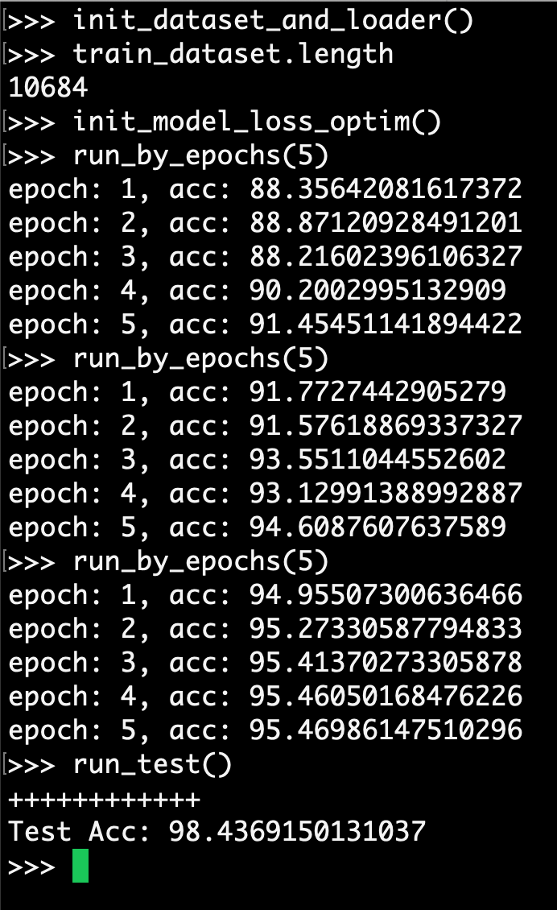
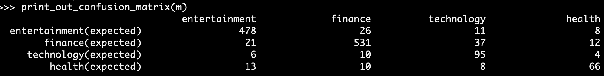
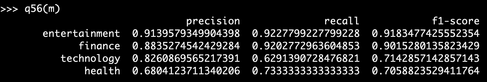
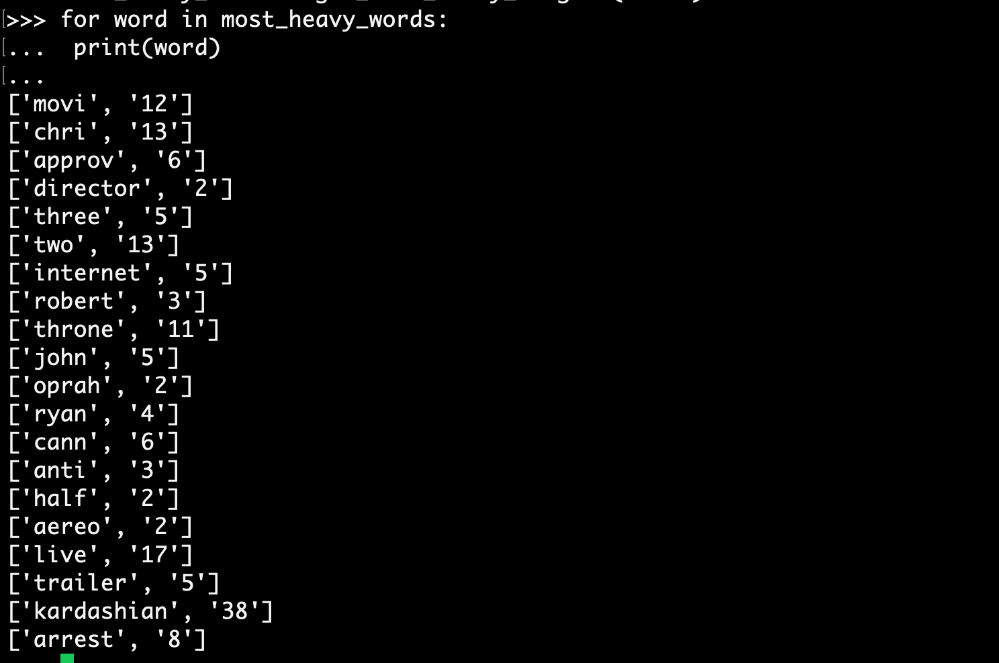
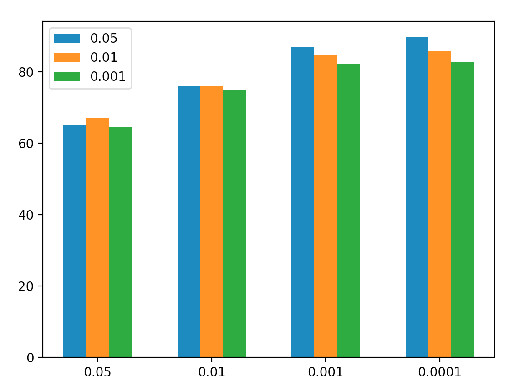

# Prepare Model & Run Test

## Train Model
1. `python3 -i index.bag_of_word.py`
2. `init_dataset_and_loader()`
3. `init_model_loss_optim()`
4. `run_by_epochs(10)`
5. `run_test()`

## Use Trained Model
1. `python3 -i index.bag_of_word.py`
2. `load_saved_model()`
5. `run_test()`

## Test Result Example

# 混同行列の作成(No.55)
1. `python3 -i index.bag_of_word.py`
2. `load_saved_model()`
3. `dataset = ReviewDataset('test.formatted.txt')`
4. `m = get_test_confusion_matrix(dataset)`
5. `print_out_confusion_matrix(m)`

## Result Example

# 適合率，再現率，F1スコアの計測

# 特徴量の重みの確認

# 正則化パラメータの変更
## Usage
1. `python3 -i index.bag_of_word.py`
2. `matrix, decays = get_acc_matrix_on_different_regula_param()`
3. `plot_acc_vs_regul_param(matrix, decays)`

## Result

yaxis: accuracy, xaxis: rate of weight decay, 3 columns every bar: train/test/valid

