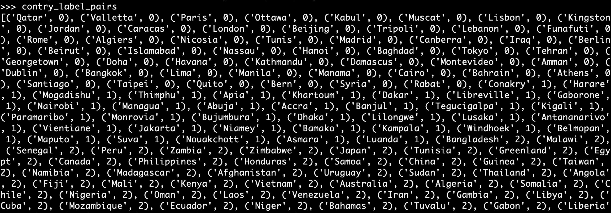

# Usage 

## Enter interative mode & Init model 

1. Download `GoogleNews-vectors-negative300.bin` into current folder.
2. `python3 -i index.py`
3. `init_model()`

## Question No.60 to No.63

Run `q60()` for No.60 `q61()` for No.61 and so on.

## No.64

The `questions-words.txt` file is processed. 

But you can delete it and do:

1. Download `questions-words.txt` into current folder.
2. `q64()`

This will take more than 1 hour to process.

## No.65

意味不明

## No.66

Result: 0.7000217838950313

1. `preprocess_q66()`
2. `r = q66()`

## No.67

Just call `q67()` to get contry label pairs, something like this:

## No.68

