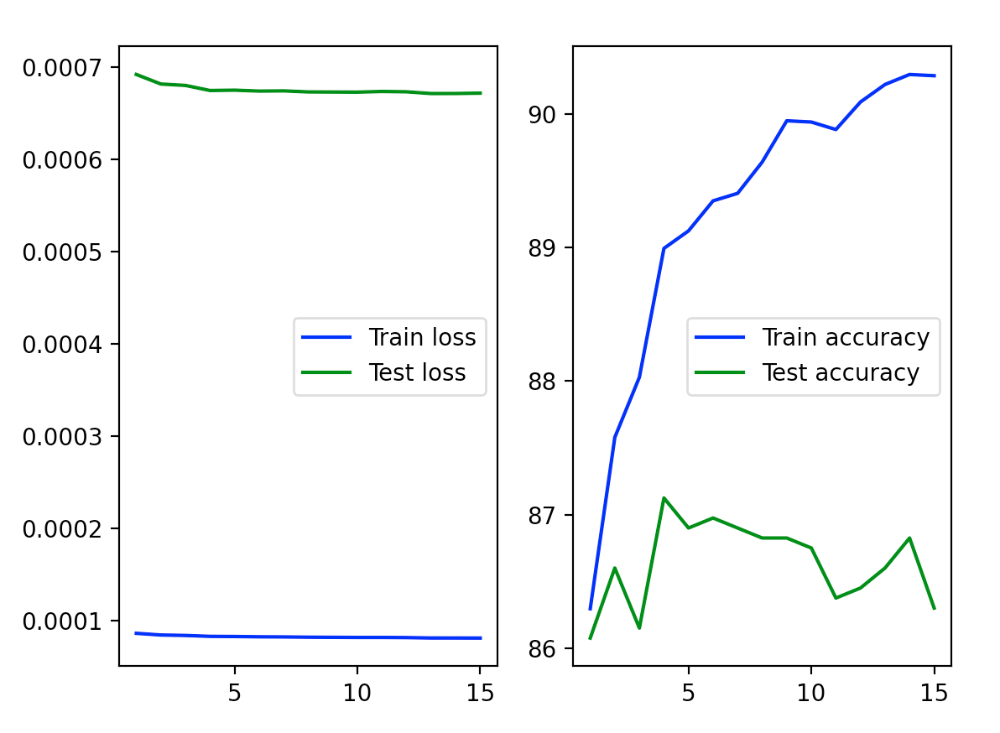

# 300-4 Network

1. `python3 -i index.py`
2. `prepare_feature_files()` only if have never call this.
3. `init_dnn_components()`
4. `a,b,c,d,e = run_by_epochs(20)`
4. `plt_loss_and_accuracy(a,b,c,d,e)`

# Result

# 300-10-relu-4 Network

1. `python3 -i index.py`
2. `prepare_feature_files()` only if have never call this.
3. `init_dnn_components_300_10_relu_4()`
4. `a,b,c,d,e = run_by_epochs(20)`
4. `plt_loss_and_accuracy(a,b,c,d,e)`

# Result

