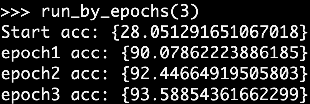
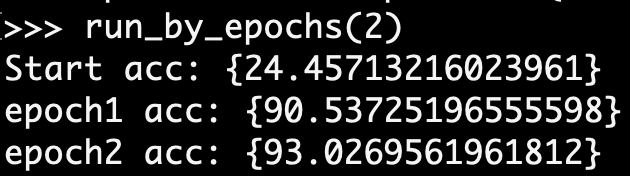

## 80 -> 83

1. `init_samples_model_onehot()`
2. `run_by_epochs(3)`

result:

## 84

1. `init_samples_model_vec300()`
2. `run_by_epochs(3)`

result:

## 85

1. `init_binet_model()`
2. `run_by_epochs(2)`

result:

