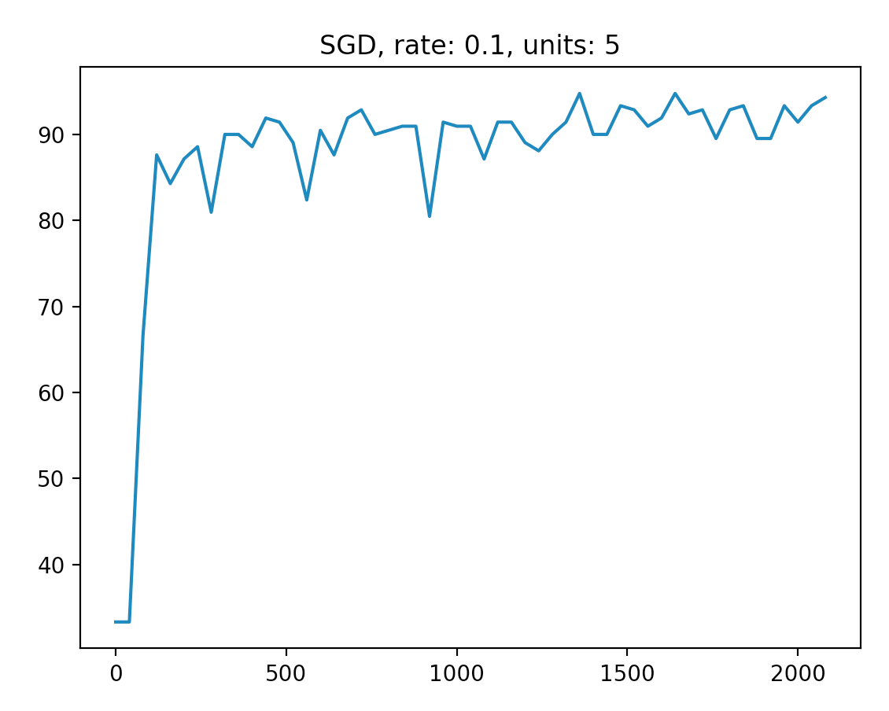
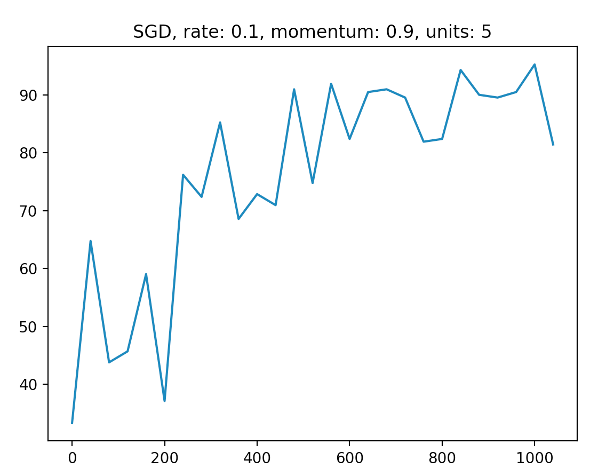
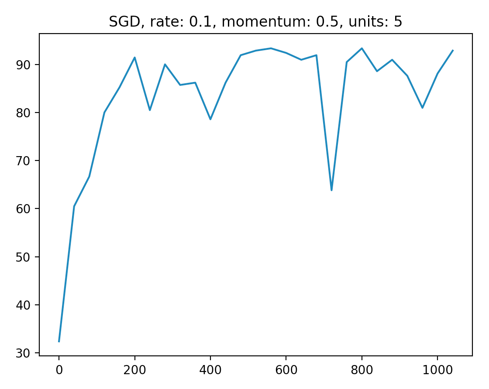
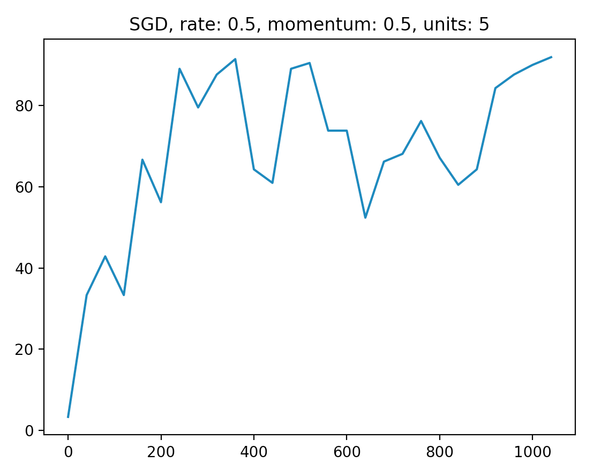

## How to use

1. `python3 -i solve-wheat-seeds.py`
2. `run_1000_and_draw()`

## Output

y: Accuracy
x: Times of feeding a random sample

### Before using SGD-with-momentum 

### Using SGD-with-momentum
Frictioness = 0.9

Frictioness = 0.5

Frictionness = 0.5 & Learing rate = 0.5(0.1 by default)

