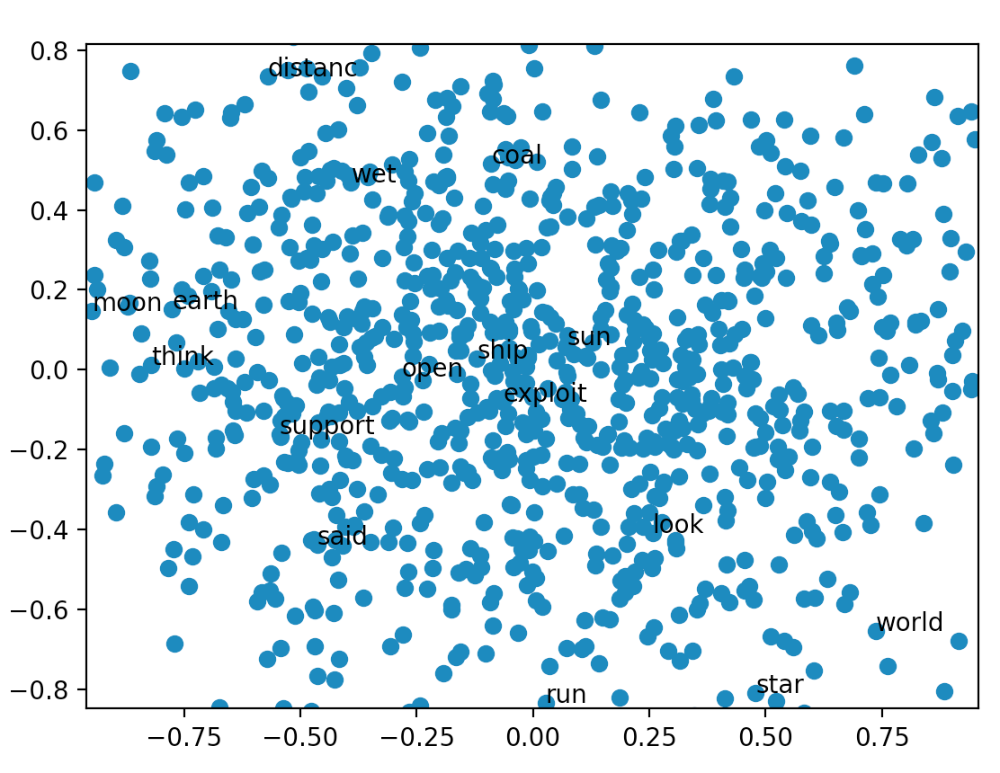
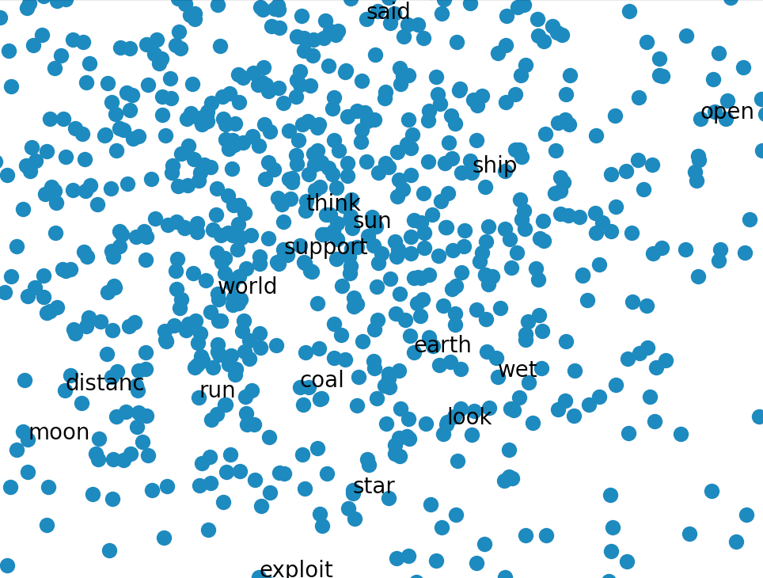

## How to use

1. `python3 -i word2vec-handwrite.py` 
2. `init()` 
3. Run function `one_epoch()` to iterate the input file once and ajust weights
4. `plot()` 

## Iterate once

## Iterate 14 times

